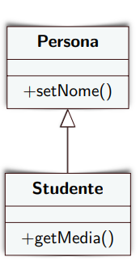
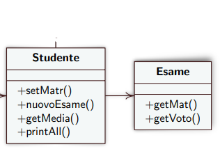

# Classi, Ereditarietà e Polimorfismo

Un programmatore ha spesso la necessità di **riutilizzare** delle classi precedentemente create.

È possibile farlo senza copiare ed incollare il codice, in modo semplice e senza alcuna modifica del codice esistente.


## Ereditarietà delle Classi

Definire una nuova classe indicando solo cosa ha in più rispetto ad una classe esistente: ovvero **attributi e metodi nuovi**, e **modificando i metodi esistenti**.

L’ereditarietà permette di definire una **classificazione di tipi**.
**Una sottoclasse è un sottotipo compatibile con la superclass**, ovvero
una sottoclasse è anche ciò che è la superclasse 

Una sottoclasse può prendere il posto della superclasse (ma non il contrario!)

## Sottoclasse

* Eredita tutti i metodi e gli attributi della superclasse e
può usarli come se fossero definiti localmente
* Aggiunge altri metodi
* Può ridefinire i metodi della superclasse
* Non può eliminare metodi o attributi della superclasse

<p align="center">
    
</p>

## Associazione

Indica la dipendenza tra due classi.

Nell'esempio sottostante la classe Studente ha bisogno delgli attributi e dei metodi della classe Esami per poter funzionare correttamente.

<p align="center">
    
</p>


## Visibilità

* Ciò che è **private** è visibile solo alla classe, non alla
sottoclasse
* Ciò che è **public** è visibile a tutti, anche alla sottoclasse
* Ciò che è **protected** è visibile alle sottoclassi ma non a tutte le
altre classi

## Interfacce
In Java una interfaccia riprende il concetto di interfaccia di sistemi orientati ad oggetti.

* Non fornisce una implementazione per i metodi
* Permette di definire un tipo
* Elenca le signature dei metodi public (senza corpo dei metodi)
* Posso solo dichiarare i metodi
* Niente attributi non inizializzati, niente costruttori


```java
public interface IAccount 
{
    public void setBalance();
}
```

<p align="center">
    
</p>

## Classi ed Interfacce

Una classe può implementare un’interfaccia, ovvero, la classe
fornisce un’implementazione dei metodi definiti dall’interfaccia.

**ATTENZIONE:** Non è possibile istanziare interfacce!

```java
public class AccountV2 implements IAccount {
public void setBalance() {}
}
public class M {
public void main(String[] args) {
 IAccount a = new AccountV2();
 a.setBalance();
 }
}
```

## Classi Astratte

Una classe astratta è una classe **parzialmente implementata**.
Alcuni metodi sono implementati, altri no (e quest’ultimi sono **abstract**).

Un metodo abstract (senza implementazione) è utile poiché:
* Altri metodi della stessa classe (implementati) possono invocarlo.
* I client si aspettano di poterlo invocare.
* Forza le sottoclassi (concrete) ad implementare il metodo abstract.
* La classe astratta non può essere istanziata. 

```java
public abstract class Libro {

private String autore;
public abstract void insert();

public String getAutore() {
    return autore;
 }
}
```

## Classi Record

Tipologia di classe che funziona come **contenitore**, funzionamento simile alle _struct_ in C/C++.

Non sono previsti attributi e metodi.

```java
public record Esame(String materia, int voto){}
```

# Diagrammi UML di sequenza

* Mostra interazioni fra oggetti.
* L’asse temporale è inteso in verticale verso il basso.
* In alto in orizzontale ci sono vari oggetti.
* In ciascuna colonna se l’oggetto esiste è indicato con una linea tratteggiata, detta **linea della vita**, e se è attivo con una **barra di attivazione**.
* Una chiamata di metodo è indicata da una **freccia piena** che va dalla barra di attivazione di un oggetto ad un altro.

```java
public class MainEsami {
 public static void main(String[] args) {
 Studente s = new Studente();
 s.nuovoEsame("Italiano", 8);
 }
}
```

<p align="center">
    
    
</p>

**Nota Bene:** s:Studente indicano rispettivamente nome dell'istanza (s) e nome della Classe (Studente).