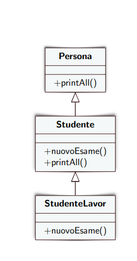
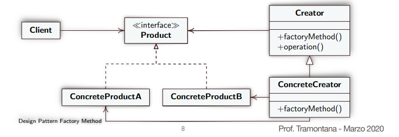
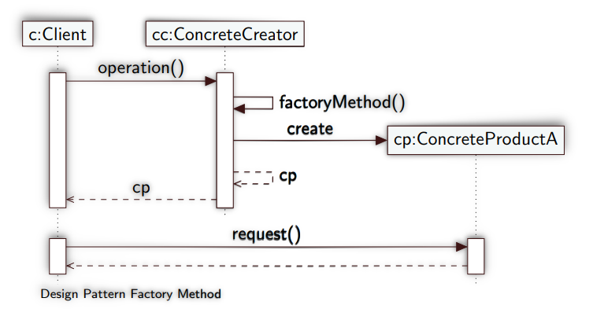

## Late Binding (Collegamento in ritardo)

Opposto dell'early binding, mentre l'early binding fornisce il controllo in fase di compilazione di tutti i tipi in modo che non si verifichino cast impliciti, il late binding controlla i tipi solo quando l'oggetto viene creato o viene eseguita un'azione sul tipo.

```java
public void m() {
 Persona p = new Persona();
 Studente s = new Studente();
 Persona px;
if (i > 10)
 px = p;
else
 px = s;
px.printAll();
} 

```

printAll() invocato su px può assumere il comportamento definito in Persona o quello definito in Studente.

A runtime si decide quale printAll() eseguire, ovvero si ha **late binding**, ed il comportamento di printAll() è **polimorfo**

## Polimorfismo

Nei sistemi ad oggetti possono esistere metodi con lo stesso nome e la stessa signature (in classi diverse).

<p align="center">
    
</p>

Quando si usa l’ereditarietà e sono stati definiti metodi con lo stesso nome, la chiamata ad un metodo può avere effetti diversi, ovvero il comportamento è **polimorfo**.

Il polimorfismo è una caratteristica fondamentale dei sistemi ad
oggetti.

Il **late binding** è tipico dei sistemi in cui esiste il polimorfismo.

## Sottoclassi e Dispatch

```java
public class Account {
protected float balance;
public void setBalance(float amount) {
 System.out.println("in account set-balance");
 if (check(amount))
    balance = amount;
 }
public boolean check(float amount) {
    System.out.println("in account check");
    return (balance + amount) >= 0;
 }
}

public class SavingAccount extends Account {
public boolean check(float amount) {
    System.out.println("in saving-account check");
    return (balance + amount) >= 1000;
 }
}

public class AccTest {
public static void main(String[] args) {
    Account acc = new SavingAccount();
    acc.setBalance(1234);
 }
}
```

Nell'esempio sopra il main chiama il metodo **setBalance()** presente nella classe Account, quest'ultimo a sua volta chiama il metodo **check()** (presente sia nella classe Account che in SavingAccount tramite override).

Una volta eseguito quale metodo **check()** viene eseguito?

- [ ] Quello presente nella classe Account
- [x] Quello presente nella classe SavingAccount

A **compile-time** acc è di tipo Account, mentre a **run-time** è di tipo SavingAccount.

Il metodo **setBalance()**, non è presente nella classe SavingAccount quindi si esegue l'operazione di **dispatch** sulla superclasse Account e viene quindi chiamato il metodo **Account.setBalance()**.

Il metodo **check()** è presente nella classe SavingAccount quindi viene eseguito **SavingAccount.check()**, senza effettuare alcuna operazione di dispatch verso la superclasse Account.

## Tipi di variabili e tipi a runtime

A **compile time**, si dichiara una variabile di un certo tipo, ed il tipo determina quali operazioni, quali signature, si possono usare. Tale tipo può essere una classe o **un’interfaccia**.

A **runtime**, l’oggetto riferito dalla variabile ha una sola implementazione che è sempre una classe, **non un’interfaccia**. 

**Il tipo a runtime di un oggetto non cambia mai**.

```java

Persona p = new Studente();

Studente s = p; //GENERA ERRORE A COMPILE TIME

Studente s = (Studente) p; //Tramite casting assicuriamo al compilatore che p è di tipo studente anche se a compile time viene visto di tipo Persona.

Persona p = new Persona();

Studente s = (Studente) p; //ERRORE! p in questo caso sia a compile time che a run time è di tipo persona il casting non può cambiare il tipo di un oggetto, questo genera un errore chiamato ClassCastException

```

# Design Pattern

Sono **strutture software** (ovvero microarchitetture) per un piccolo numero di classi che descrivono
soluzioni di successo per problemi ricorrenti.

## Perchè usare i Design pattern?

* Aiutano i **principianti** ad agire come se fossero **esperti**.
* Supportano gli **esperti** nella progettazione su **grande scala**.
* Evitano di re-inventare concetti e soluzioni, **riducendo il costo**.
* **Forniscono un vocabolario** comune e permettono una comprensione dei principi del design.
* Analizzano le loro proprietà non-funzionali: ovvero, come una
funzionalità è realizzata.
    Esempi:
    * affidabilità;
    * modificabilità;
    * sicurezza;
    * testabilità;
    * riuso.

## Descrizione di un pattern

* **Nome:** permette di identificare il design pattern con una parola e di
lavorare con un alto livello di astrazione, indica lo scopo del pattern
* **Intento:** descrive brevemente le funzionalità e lo scopo
* **Problema** (Motivazione + Applicabilità): descrive il problema a cui il
pattern è applicato e le condizioni necessarie per applicarlo
* **Soluzione:** descrive gli elementi (classi) che costituiscono il design
pattern, le loro responsabilità e le loro relazioni
* **Conseguenze:** indicano risultati, compromessi, vantaggi e svantaggi
nell'uso del design pattern
* **Esempi di utilizzo:** illustrano dove il design pattern è stato usato
* **Codice:** fornisce porzioni di codice che lo implementano

## Tipologie di un design pattern

I design pattern sono organizzati sul catalogo  in base allo scopo.

* **Creazionali:** riguardano la creazione di istanze
    * Singleton, 
    * Factory Method, 
    * Abstract Factory 
    * Builder 
    * Prototype

* **Strutturali:** riguardano la scelta della struttura
    * Adapter 
    * Facade 
    * Composite 
    * Decorator 
    * Bridge 
    * Flyweight
    * Proxy

* **Comportamentali:** riguardano la scelta dell’incapsulamento di
algoritmi

    * Iterator 
    * Template Method 
    * Mediator
    * Observer
    * State
    * Strategy
    * Chain of Responsibility
    * Command
    * Interpreter
    * Memento
    * Visitor

## Design Pattern Creazionali

Permettono di **astrarre il processo di creazione oggetti**: rendono un sistema indipendente da come i suoi oggetti sono creati,
composti, e rappresentati.

**Nascondono come le istanze delle classi sono create e composte**

# Desing Pattern Factory Method

**Intento**

    Definire una interfaccia per creare un oggetto, ma lasciare che le sottoclassi decidano quale classe istanziare.
    
    Factory Method permette ad una classe di rimandare l’istanziazione alle sottoclassi.

**Problema**

    Un framework usa classi astratte per definire e mantenere relazioni tra oggetti. 
    Il framework deve creare oggetti ma
    conosce solo classi astratte che non può istanziare.

    Un metodo responsabile per l’istanziazione (detto factory, ovvero fabbricatore) incapsula la conoscenza su quale classe creare.

**Soluzione**

* **Product:** Interfaccia comune a tutti gli oggetti
* **ConcreteProduct:** Implementazione di Product
* **Creator:** dichiara il **factoryMethod()** e ritorna un oggetto di tipo Product.
* **ConcreteCreator:** implementa **factoryMethod()** anche tramite override, sceglie quale ConcreteProduct istanziare e ritorna tale istanza.

<p align="center">
    
    
</p>