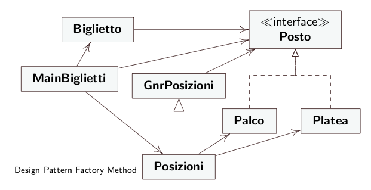

# Factory Method - Codice 

* **Product:** Posto
* **ConcreteProduct:** Palco, Platea
* **Creator:** GnrPosizioni
* **ConcreteCreator:** Posizioni
* **Client:** Biglietto

## Diagramma UML

    

## Diagramma UML Sequenziale

    

