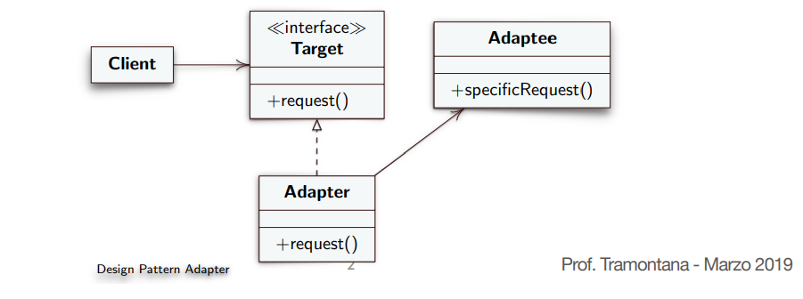
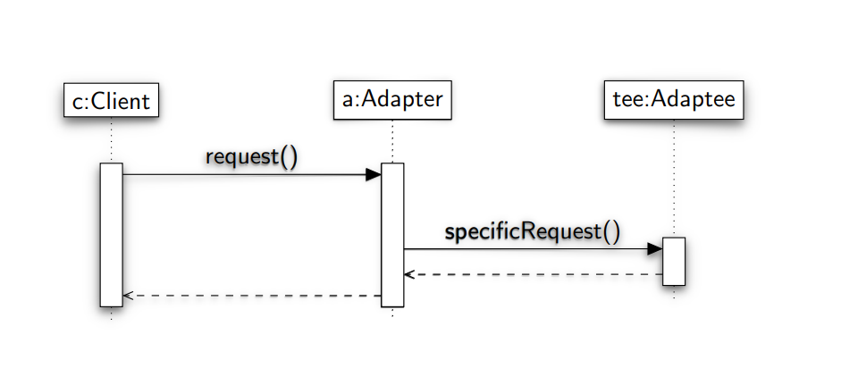

# Design Pattern Adapter (Design Pattern Strutturale)

**Intento**

    Converte l’interfaccia di una classe in un’altra interfaccia che i client si aspettano. 
    Adapter permette ad alcune classi di
    interagire, eliminando il problema di interfacce incompatibili.

**Problema**

    Alcune volte una classe di una libreria non può essere usata poiché incompatibile con l’interfaccia che si aspetta l’applicazione. 
    
    Ovvero nome metodo, parametri, tipo parametri di chiamate all’interno dell’applicazione non sono corrispondenti a quelli offerti da una classe di libreria.

    • Non è possibile cambiare l’interfaccia della libreria, poiché non si ha il sorgente.

    • Non è possibile cambiare l’applicazione, e si può voler cambiare quale metodo invocare, senza renderlo noto al chiamante.

**Soluzione**

* **Target:** è l’interfaccia che il chiamante si aspetta
* **Adaptee:** è l’oggetto di libreria
* **Adapter:** converte, ovvero adatta, la chiamata che fa una classe
client all’interfaccia della classe di libreria. 

    
    

## Variante Adapter a due vie

La classe Adapter fornisce l’interfaccia di Target e
l’interfaccia di Adaptee. 

**Realizzazione:** la soluzione Class Adapter è un
Adapter a due vie.

## Conseguenze del Design Pattern Adapter

* Client e classe di libreria Adaptee rimangono indipendenti. 
* L’Adapter
può cambiare il comportamento dell’Adaptee
* Può aggiungere test di precondizioni e postcondizioni
* L’Object Adapter può implementare la tecnica di **Lazy Initialization**
* Il design pattern Adapter aggiunge un livello di indirettezza.

 Ogni invocazione del client ne scatena un’altra fatta dall’Adapter. 
 
Possibile rallentamento, e codice più difficile da comprendere.
