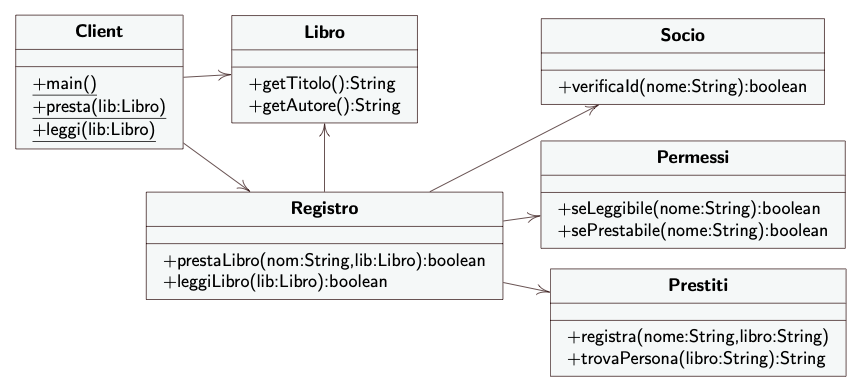
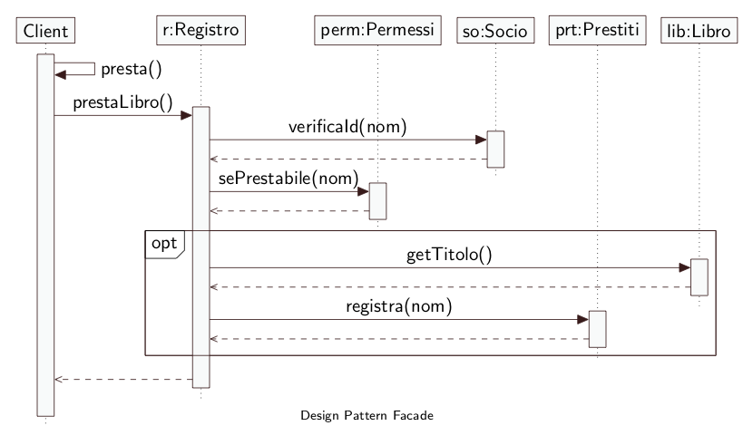

# Design pattern Facade - Codice 

* **Facade:** Registro
* **Client:** Client
* **Classi del sottosistema:** Prestiti, permesso, Socio
* **Classe del sistema:** Libro

## Diagramma UML

    

## Diagramma UML Sequenziale

    

