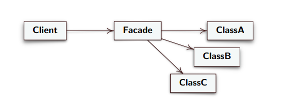

# Design Pattern Facade (Design Pattern Strutturale)

**Intento**

   Fornire un’interfaccia unificata al posto di un insieme di
    interfacce in un sottosistema (consistente di un insieme di classi).
    Definire un'interfaccia di alto livello (semplificata) che rende il
    sottosistema più facile da usare.

**Problema**

    • Spesso si hanno tante classi che svolgono funzioni correlate e
    l’insieme delle interfacce può essere complesso

    • Può essere difficile capire qual è l’interfaccia essenziale ai client
    per l’insieme di classi

    • Si vogliono ridurre le comunicazioni e le dipendenze dirette fra i
    client ed il sottosistema

**Soluzione**

* **Facade:** fornisce un’unica interfaccia semplificata ai client e
nasconde gli oggetti del sottosistema, questo riduce la
complessità dell’interfaccia e quindi delle chiamate. Facade
invoca i metodi degli oggetti che nasconde
* **Client:** interagisce solo con l’oggetto Facade 

    

## Conseguenze del Design Pattern Facade

* **Conseguenze**
    * Nasconde ai client l’implementazione del sottosistema.
    * Promuove l’accoppiamento debole tra sottosistema e client.
    * Riduce le dipendenze di compilazione in sistemi grandi. Se si
    cambia una classe del sottosistema, si può ricompilare la parte
    di sottosistema fino al facade, quindi non i vari client.
    * Non previene l’uso di client più complessi, quando occorre, che
    accedono ad oggetti del sottosistema.
* **Implementazione**
    * Per rendere gli oggetti del sottosistema non accessibili al client
    le corrispondenti classi possono essere annidate dentro la
    classe Facade.
