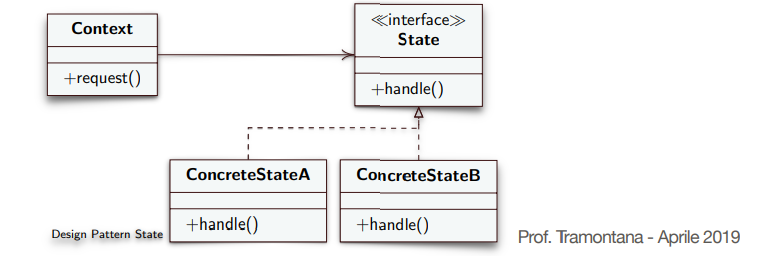
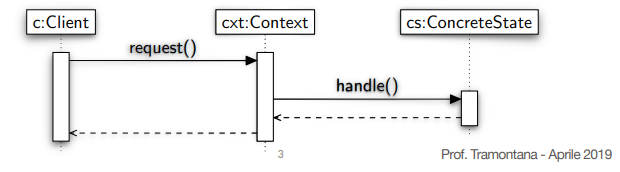

# Design Pattern State (Design Pattern Comportamentale)

**Intento**

    Permettere ad un oggetto di alterare il suo
    comportamento quando il suo stato interno cambia. 
    Far sembrare che l’oggetto abbia cambiato la sua classe 

**Problema**

    • Il comportamento di un oggetto dipende dal suo stato e il
    comportamento deve cambiare a run-time in base al suo stato

    • Le operazioni da svolgere hanno vari grandi rami condizionali
    che dipendono dallo stato

    • Lo stato è spesso rappresentato dal valore di una o più variabili
    enumerative costanti
    
    • Spesso varie operazioni contengono la stessa struttura
    condizionale

**Soluzione**

Inserire ogni ramo condizionale in una classe separata:

* **Context:** Definisce l’interfaccia che interessa ai client, e mantiene
un’istanza di una classe ConcreteState che definisce lo stato corrente
* **State:** Definisce un’interfaccia che incapsula il comportamento
associato ad un particolare stato del Context
* **ConcreteState:** Sono le sottoclassi che implementano ciascuna il
comportamento associato ad uno stato del Context

    

* Il **Client** non deve conoscere i **ConcreteState**
* Il **Context** passa le richieste dipendenti da un certo stato all’oggetto **ConcreteState** corrente
* Un **Context** può passare se stesso come argomento all’oggetto
**ConcreteState** per farlo accedere al contesto se necessario
* Il **Context** è l’interfaccia per le classi client
* Il **Context** o i **ConcreteState** decidono quale stato è il successivo ed in quali circostanze

    

## Conseguenze del Design Pattern State

* Il comportamento associato ad uno stato è localizzato in una sola
classe (**ConcreteState**) e si partiziona il comportamento di stati
differenti. Per tale motivo, si posso aggiungere nuovi stati e
transizioni facilmente, creando nuove sottoclassi. Incapsulare le
azioni di uno stato in una classe impone una struttura e rende più
chiaro lo scopo del codice
* La logica che gestisce il cambiamento di stato è separata dai vari
comportamenti ed è in una sola classe (**Context**), anziché (con
istruzioni if o switch) sulla classe che implementa i comportamenti.
Tale separazione aiuta ad evitare stati inconsistenti, poiché i
cambiamenti di stato vengono decisi da una sola classe e non da
tante
* Il numero di classi totale è maggiore, le classi sono più semplici
