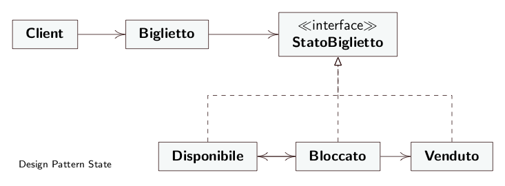
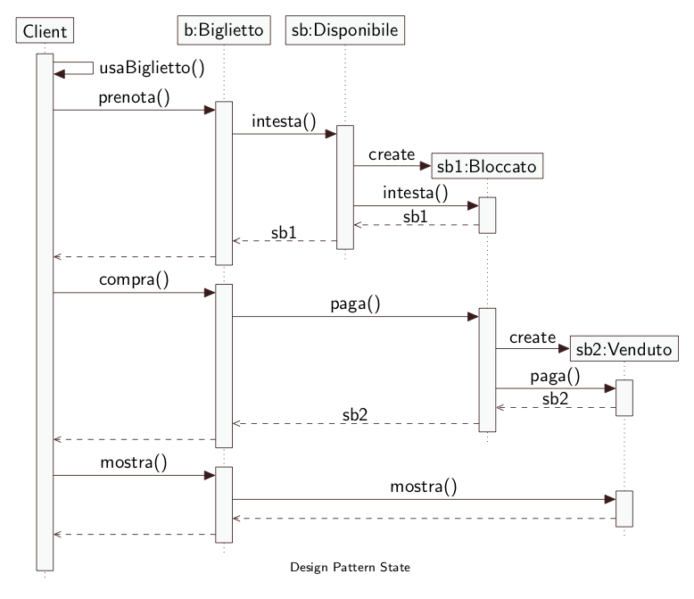

# Design pattern State - Codice 

* **Context:** Biglietto
* **State:** StatoBiglietto
* **ConcreteState:** Disponibile, Bloccato, Venduto

## Diagramma UML

    

## Diagramma UML Sequenziale

    

